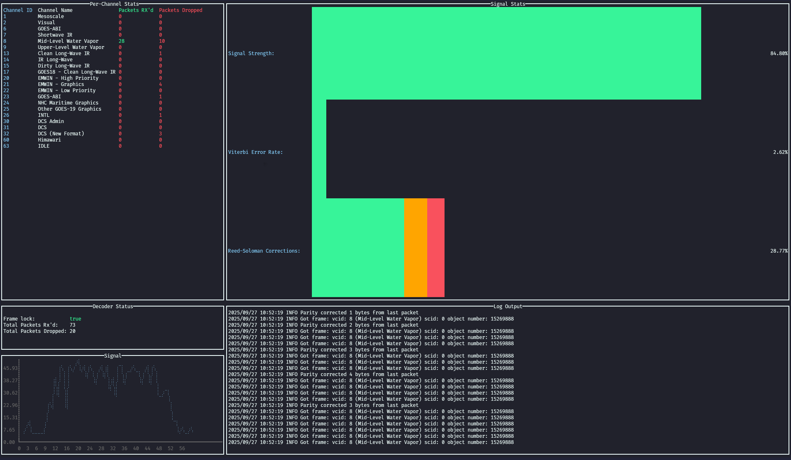

# GOESTuner

`goestuner` is a simple CLI tool that can be used to help orient your parabolic dish with one of the GOES satellites. Think of it as a simple 'signal strength meter' for GOES/HRIT satellites, with large signal strength bars that are easier to see on a screen in sunlight. 



### Dependencies
* SoapySDR and any required module (e.g. SoapyRTLTCP for RTL_TCP)
* `libsathelper`: See [here](https://github.com/opensatelliteproject/libsathelper/blob/master/README.md) for build and installation instructions
* `libcorrect`: See above
* Go version 1.18+

### Supported SDRs

So far this tool has only been verified as working with the SDRs listed below, but theoretically, it should work for any SDR that SoapySDR supports, and any SDR that supports complex samples. I do not have the resources to test every SDR under the sun, so if anyone is able to test this with other SDR's supported by SoapySDR, please let me know so they can be added to the list of supported radios!

* RTL-SDR Blog v3
* `rtl_tcp` (via the SoapyRTLTCP module)

### Installation

#### Raspberry Pi (Debian 13)

Install dependencies:
* `sudo apt install libsoapysdr-dev cmake build-essential`
* Build `libsathelper`:
  * `git clone https://github.com/opensatelliteproject/libsathelper`
  * `cd libsathelper`
  * `make libcorrect`
  * `sudo make libcorrect-install`
  * `make`
  * `sudo make install`

Once the dependencies are satisfied, you can simply install `goestuner` with `go install`:
```
go install github.com/jrwynneiii/goestuner@latest
```

#### Fedora 42+
Install dependencies:
* `sudo dnf install gcc g++ make cmake soapy-rtlsdr SoapySDR-devel SoapySDR `
* Build `libsathelper`:
  * `git clone https://github.com/opensatelliteproject/libsathelper`
  * `cd libsathelper`
  * Apply patch to allow libsathelper to be built with modern GCC
    * `wget https://raw.githubusercontent.com/JRWynneIII/goestuner/refs/heads/main/libsathelper.patch ; git apply libsathelper.patch`
  * `make libcorrect`
  * `sudo make libcorrect-install`
  * `make`
  * `sudo make install`


Once the dependencies are satisfied, you can simply install `goestuner` with `go install`:
```
go install github.com/jrwynneiii/goestuner@latest
```

Next, you will need to modify and copy the config file (`config.hcl`) to either `/etc/config.hcl`, `~/.config/goestuner/config.hcl`, or have a `config.hcl` in your current working directory where you run this tool.

### Usage
```
Usage: goestuner <command> [flags]

Flags:
  -h, --help       Show context-sensitive help.
      --verbose    Prints debug output by default

Commands:
  probe [flags]
    List the available radios and SoapySDR configuration

  tune [flags]
    Starts the frontend webserver

Run "goestuner <command> --help" for more information on a command.
```

* `probe`: Queries SoapySDR to list the available SDRs and their respctive settings (NOTE: Does not show anything for `rtl_tcp` devices)
* `tune`: Starts the HRIT demodulator/decoder and TUI. Please note, that while the demodulator/HRIT decoder isn't perfect, it may take up to 30 seconds for `goestuner` to get a lock on the signal, and start decoding packets. This is normal.

### Configuration

The `goestuner` config file uses the [HashiCorp Configuration Language](https://hcl.readthedocs.io/en/latest/language_design.html) DSL. Included as `config.hcl`, the example configuration file should be enough to get you started. Most values will never need to be changed, except for the `radio {}` block. This contains the configuration that is used to tell SoapySDR which radio to use. Included in the config file is an example for an RTL-SDR dongle, and one for accessing an SDR over `rtl_tcp`.

Additionally, `goestuner` has the ability to read configuration from environment variables. The same example configuration as is set in `config.hcl` is replicated in `config.sh`. Simply modify this file and run `source /path/to/config.sh ; goestuner tune` to utilize this feature

#### Radio
For example, if you have an RTL-SDR connected directly via USB, your `radio {}` block should look something like this:
```
radio {
  driver = "rtlsdr"
  device_index = 0
  gain = 5
  frequency = 1694100000
  sample_rate = 2048000
  sample_type = "complex64"
  decimation = 1
}
```

If you only have 1 dongle attached, this should work right out of the box. Otherwise, specify the `device_index` for the radio you would like to use. 

Alternatively, if you'd like to connect `goestuner` to an `rtl_tcp` server, simply change the driver to `"rtltcp"`, and add the address parameter (e.g. `address = "192.168.0.100:1234"`)

#### TUI
A few tunables are exposed to allow cusomization of the TUI. These parameters are listed in the `tui {}` block in the config file. 
* `refresh_ms = 500`: Sets the refresh rate of the signal meters and packet/decoder stats to half a second (value is in milliseconds)
* `rs_threshold_warn_pct = 20`: Defines the percentage value that the "Reed-Soloman Corrections" meter turns yellow
* `rs_threshold_crit_pct = 25`: Defines the percentage value that the "Reed-Soloman Corrections" meter turns red
* `vit_threshold_warn_pct = 10`: Defines the percentage value that the "Viterbi Error Rate" meter turns yellow
* `vit_threshold_crit_pct = 15`: Defines the percentage value that the "Viterbi Error Rate" meter turns red
* `enable_log_output = true`: Disables the log output in the bottom box, and makes the signal meters larger. Helpful if the meters are still too small to see on a laptop screen in the sunlight

### Acknowledgements:

I'd like to thank the [Open Satellite Project](https://github.com/opensatelliteproject) for creating `libsathelper`, and `SatHelperApp`; these two projects were extremely helpful in the development of the demodulator and decoder, and served, not only as a good reference point for development of `goestuner`, but as a wonderful reference for learning various concepts about SDR and xRIT programming. 
